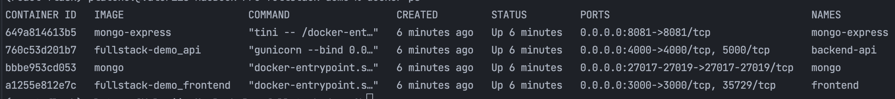

# Full Stack Demo 

To better gauge your skills as a full stack developer and your fit into engineering team.

## Submission Instructions
1. Fork this project on GitHub. You will need to create an account if you don't already have one.
2. Push all of your changes to your fork on GitHub and submit a pull request.

## Project Description
A simple Spending Tracker app to track spending costs. The app allow you to add and remove items from the list.
We have included a wireframe (Spending Tracker.jpg) to show the basic functionality and give you a starting point.


The project consist of three parts:
1. A frontend created with React
    - keep the frontend simple.
2. A backend api to save the list to a db
   - stack Python/Flask and MongoDB
   - REST API endpoints
3. Docker composer to run in docker env: easy to set up, a clear step by step instructions on how to run on Linux distros such as ubuntu, centos or debian. It is not require any non open-source software.


## Installation

### Install Docker & Docker compose
[Docker Compose](https://docs.docker.com/compose/install/)

### Dependencies
#### Bootstrap theme [simplex](https://bootswatch.com/simplex/)

#### MongoDB engine & Mongo Express [Flask with MongoDB](https://www.mongodb.com/compatibility/setting-up-flask-with-mongodb)


#### React 17.0.2 with Router 6.2.1 [Create React App](https://reactjs.org/docs/create-a-new-react-app.html)

### Start 

```shell
git clone git@github.com:vpplatonov/fullstack-demo.git
cd fullstack-demo
docker-compose up -d
```

Check
```shell
docker ps
```
Output

Navigate to [http://localhost:3000](http://localhost:3000)
#### Final screenshot 

### Stop App

```shell
docker-compose down
docker-compose down --volumes
docker system prune -f -a
```

## TODO

- fix Clear Button
- Total Spending in Navbar
- Format Date field
- Adding features such as sorting and filtering the list
- Test coverage by pytest & ESlint

## License

MIT
